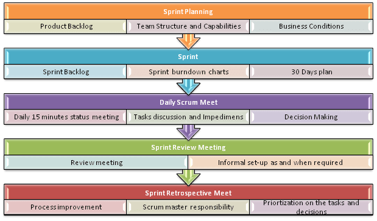

# What is Agile Model in Software Testing?

## What is Agile Methodology?
Agile Methodology meaning a practice that promotes continuous iteration of development and testing throughout the software development lifecycle of the project. In the Agile model in software testing, both development and testing activities are  concurrent, unlike the Waterfall model.

## What is Agile Software Development?
The Agile software development methodology is one of the simplest and effective processes to turn a vision for a business need into software solutions. Agile is a term used to describe software 
develeopment approaches that employ continual planning, learning, improvement, team collaboration, evolutionary development, and early delivery. It encourages flexible responses to change.

--- 
#### The agile software development emphasizes on four values
1. Individual and team interactions over processes and tools.
2. Working software over comprehensive documentation.
3. Customer collaboration over contract negotiation.
4. Responding to change over following a plan.
---

## Agile Model Vs Waterfall Model
Agile and Waterfall model are tow different methods for software development process. Though they are different in their approach, both methods are useful at times, depending on the requirement and the type of the project.

| Agile Model | Waterfall Model |
| -- | -- |
| Agile methodology definition: Agile methodologies propose incremental and iterative approach to software design | Waterfall Model: Development of the software flows sequentially from start point to end point.|
| The Agile process in software engineering is broken into individual models that designers work on | The design process is not broken into an individual models |
| The customer has early and frequent opportunities to look at the product and make decision and changes to the project | The customer can only see the product at the end of the project |
| Agile model is considered unstructured compared to the waterfall model | Waterfall model are more secure because they are so plan oriented |
| Small projects can be implemented very quickly. For large projects, it is difficult to estimate the development time.| All sorts of project can be estimated and completed. |
| Error can be fixed in the middle of the project. | Only at the end, the whole product is tested. If the requirement error is found or any changes have to be made, the project has to start from the beginning |
| Development process is iterative, and the project is executed in short (2-4) weeks iterations. Planning is very less. | The development process is phased, and the phase is much bigger than iteration. Every phase ends with the detailed description of the next phase. |
| Documentation attends less priority than software development | Documentation is a top priority and can even use for training staff and upgrade the software with another team |
| Every iteration has its own testing phase. It allows implementing regression testing every time new functions or logic are released. | Only after the development phase, the testing phase is executed because separate parts are not fully functional. |
| In agile testing when an iteration end, shippable features of the product is delivered to the customer. New features are usable right after shipment. It is useful when you have good contact with customers. | All features developed are delivered at once after the long implementation phase. |
| Testers and developers work together | Testers work separately from developers |
| At the end of every sprint, user acceptance is performed | User acceptance is performed at the end of the project. |
| It requires close communication with developers and together analyze requirements and planning | Developer does not involve in requirement and planning process. Usually, time delays between tests and coding |

## Agile Process Model
There are various Agile methods present in agile testing:

### Scrum
SCRUM is an agile development method which concentrates specifically on how to manage tasks within a team-based development environment. Basically, Scrum is derived from activity that occurs during a rugby match. Scrum believes in empowering the development team and advocates working in small teams (say 7 to 9 members). Agile and Scrum consist of three roles, and their responsabilities are explained as follows:

* Scrum Master

Is responsible for setting up the team, sprint meeting and removes obstacles to progress.

* Product Owner

The product Owner creates product backlog, prioritizes the backlog and is responsible for the delivery of the functionality at each iteration.

* Scrum Team

Team manages its own work and organizes the work to complete the sprint or  cycle.

### Product Backlog
This is a repository where requirements are tracked with details on the no of requirements (user stories) to be completed for each release. It should be maintained and prioritized by Product Owner, and it should be distributed to the scrum team. Team can also request for a new requirement addition or modification or deletion.

### Scrum Practices

### Precess flow of Scrum Methodologies:
* Each iteration of a scrum is known as Sprintk.
* Product backlog is a list where all details are entered to get the end-product.
+ During each Sprint, top user stories of Product backlog are selected and turned into Sprint backlog.
+ Team works on the defined sprint backlog.
+ Team chacks for the daily work.
+ At the end of the sprint, team delivers product functionality.

### Extreme Programming (XP)
Extreme Programming techniques is very helpful when there is constantly changing demands or requirements form the customers or when they are not sure about the fuctionality of the system. It advocates frecuent "releases" of the product in short development cycles, which inherently improves the productivity of the system and also introduces a checkpoint where any customer requirements can be easily implemented. The XP develops software keeping customer in the target.

Business requirements are gathered in terms of stories. All those stories are stored in a place called the parking lot.

In this type of methodology, releases are based on the shorter cycles called Iterations with span of 14 days time period. Each iteration includes phases like coding, unit testing and system testing where at each phase some minor or major functionality will be built in the application.

## Phases of eXtreme programming:
These are 6 phases available in Agile XP method, and those are :

### Planning
+ Identication of stakeholders and sponsors.
+ Infrastructure Requirements.
+ Security related information and gathering.
+ Service Level Agreements and its conditions.

### Analisis
+ Capturing of Stories in Parking lot.
+ Prioritize stories in Parking lot.
+ Scrubbing of stories for estimation.
+ Define Iteration SPAN (time).
+ Resource planning for both Development and QA teams.

### Design
+ Break down of tasks.
+ Test Scenario preparation for each task.
+ Regression Automation Framework.

### Execution
+ Coding.
+ Unit Testing.
+ Execution of Manual test scenarios.
+ Defect Report generation.
+ Conversion of Manual to Automation regresion test cases.
+ Mid Iteration review.
+ End of Iteration review.

### Wrapping
+ Small Releases.
+ Regression Testing.
+ Demos and reviews.
+ Develp new stories based on the need.
+ Process Improvements based on end of iteration review comments.

### Closure
+ Pilot Launch.
+ Training.
+ Production Launch.
+ SLA Guarantee assurance.
+ Review SOA strategy.
+ Production Support.

There are two storyboards available to track the work on a daily basis, and those are listed below for reference.

#### Story Cardboard
+ This is a traditional way of collecting all the stories in a board in the form of stick notes to track daily XP activities. As this manual activity involves more effort and time, it is better to switch to an online form.

#### Online Storyboard
+ Online tool Storyboard can be used to store the stories. Several teams can use it for defferent purposes.

## Crystal Methodologies
Crystal Methodology is based on three concepts:

1. Chartering: Various activities involved in this phase are creating a development team, preforming a preliminary feasibility analysis, developing an initial plan and fine-tuning the development methodology.
2. Cyclic delivery: The main development phase consists of two or more delivery cycles, during which the:
    
    1. Team updates and refines the release plan
    2. Implements a subset of the requirements through one or more program test integrate iterations.
    3. Integrated products is delivered to real users.

3. Wrap Up: The activities preformed in this phase are deployment into user environment, post-deployment reviews and reflections are performed.

## Dynamic Software Development Method (DSDM)
DSMD is a Rapid Application Development (RAD) approach to software development and provides an agile proyect delivery framework. The important aspect of DSDM is that the users are required to be involved actively, and the teams are given the power to make decisions. Frecuent delivery of products becomes the active focus with DSDM. The techniques used on DSDM are:

1. Time Boxing.
2. MoSCoW Rules.
3. Prototyping.

The DSDM project consists of 7 phases:

1. Pre-project.
2. Feasibility Study.
3. Business Study.
4. Funcional MOdel Iteration.
5. Design and build Iteration
6. Implementation.
7. Post-project

## Feature Driven Development (FDD)
This method is focused around "designing & building" features. Unlike other Agile methods in software engineering, FDD describes very specific and short phase of work that has to be accomplished separately per feature. It includes domain walkthroug, design inspection, promote to build, code inspection and design. FDD develops product keeping following things in the target.

1. Domain object Modeling.
2. Development by feature.
3. Component/Class Ownership
4. Feature Teams.
5. Inspections.
6. Configuration Management.
7. Regual Builds
8. Visibility of progress and results.

## Lean Software Development
Lean software development method is based on the principle "Just in time production". It aims at increasing speed of software development and decreasing cost. Lean development can be summarized in seven steps.

1. Eliminating Waste
2. Amplifying learning
3. Defer commitment (deciding as late as possible)
4. Early delivery
5. Empowering the team
6. Building Integrity
7. Optimize the whole

## Kanban vs Scrum
| Scrum | Kanban |
| -- | -- |
| In scrum technique, test must be broken down so that they can be completed within one sprint | No particular item size is prescribed |
| Prescribes a prioritized product backlog | Prioritization is optional |
| Scrum team commits to a particular amount of work for the iteration | Commitment is optional |
| Burndown chart is prescribed | No particular item size is prescribed |
| Between each sprint, a scrum board is reset | A Kanban board is persistent. It limits the number of items in workflow state |
| It cannot add items to ongoing iteration | It can add items whenever capacity is available |
| WIP limited indirectly | WIP limited directly |
| Timeboxed iterations prescribed | Timeboxed iterations optional |

### Agile metrics:
Metrics that can be collected for effective usage of Agile is:
#### Drag Factor
+ Effort in hours which do not contribute to sprint goal
+ Drag factor can be improved by reducing numbers of shared resources, reducing the amount of non-contibuting work
+ New estimates can be increased by percentage of drag factor-New estimate = (Old estimate+drag factor)
#### Velocity
+ Amount of backlog (user stories) converted to shippable functionality of sprint
#### No of Unit Test added
#### Time interval taken to complete daily build
#### Bugs detected in an iteration or in previous iterations
#### Production defect leakage

